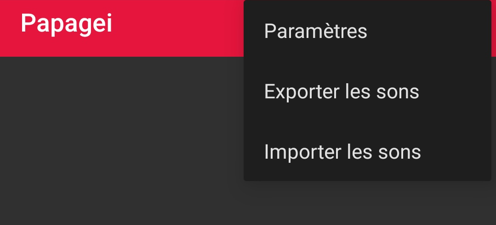
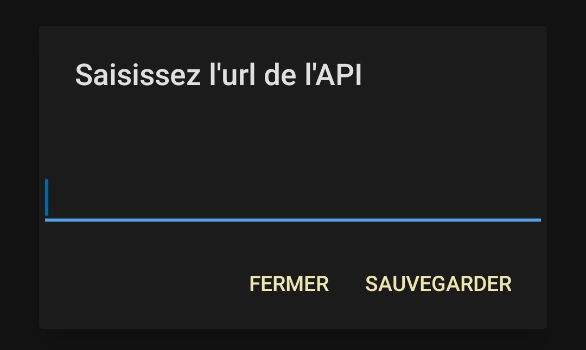
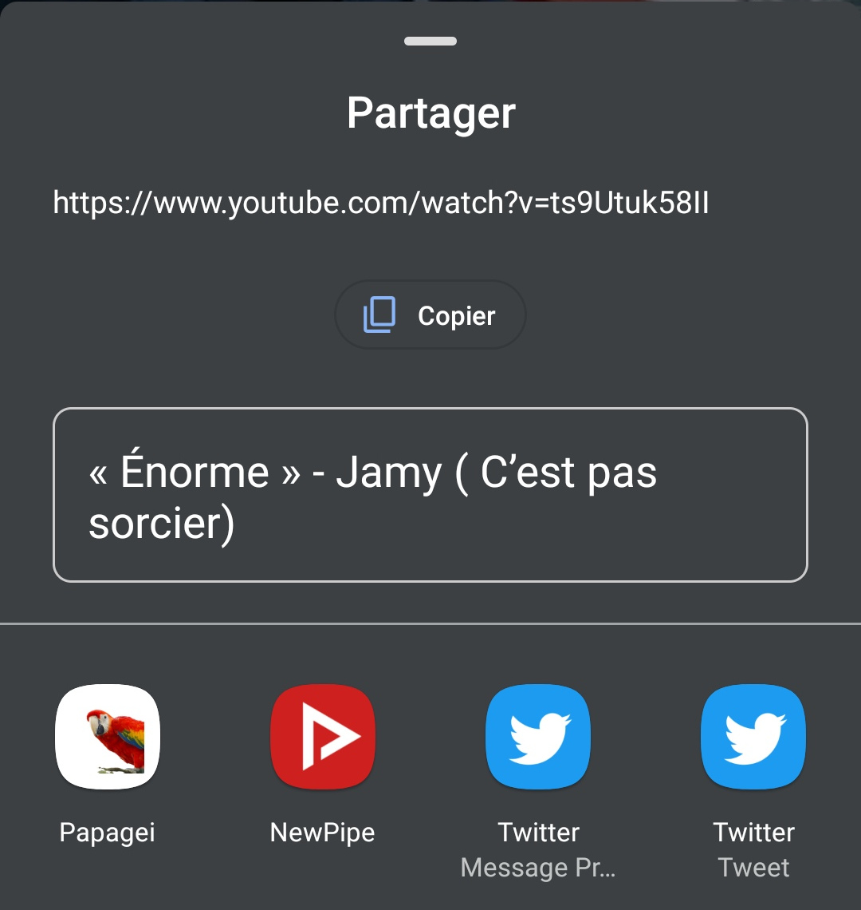
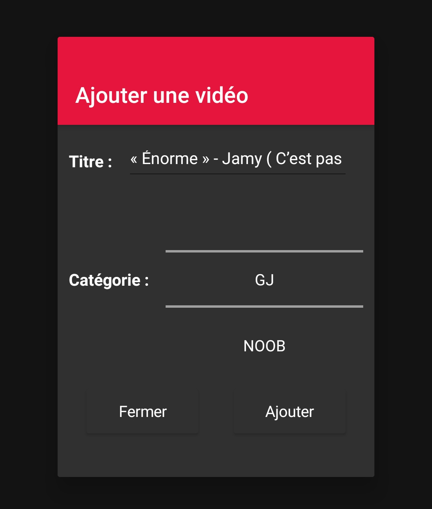

# Papagei Android App

## Installation
Télécharger [ici](https://github.com/c-noblet/papagei-app/releases/download/1.2.4/papagei.apk) l'application sur votre smartphone android.

Ensuite en cliquant sur le fichier APK, une modale vous proposera d'installer l'application. Il se peut que vous ayez à autoriser l'installation des applications de sources inconnues. Vous pouvez suivre [ce tutoriel](https://www.wikihow.com/Allow-Apps-from-Unknown-Sources-on-Android) pour autoriser l'installation.

## Configurations

Suite à l'installation de l'application, vous devez saisir l'adresse de l'api dans les paramètres de la topbar.





## Ajouter un son

Pour ajouter un son, rendez-vous sur la vidéo youtube que vous voulez ajouter. Puis partager la vidéo et sélectionner l'application Papagei. Comme ci-dessous.




Suite à cela, une modale s'ouvrira dans Papagei et vous avez alors le choix de modifier le titre de la vidéo, mais également de l'ajouter dans une catégorie.



## Jouer des sons

Avant de pouvoir jouer un son il faut que vous rejoigniez un salon vocal Discord et que le robot vous rejoigne aussi. Pour cela, saisissez dans le chat textuel la commande suivante :
```
!p join
```

Une fois que le robot est avec vous dans le salon vocal, vous pouvez jouer un son en cliquant sur une ligne de l'application mobile.

## Exporter & importer les sons
Vous pouvez exporter les sons en cliquant sur "Exporter les sons" du menu de la topbar. Cela va créer un fichier json dans le dossier Downloads avec tous vos sons.
Pour importer vos sons, cliquez sur "Importer les sons" et sélectionnez le fichier json de sauvegardes. 


